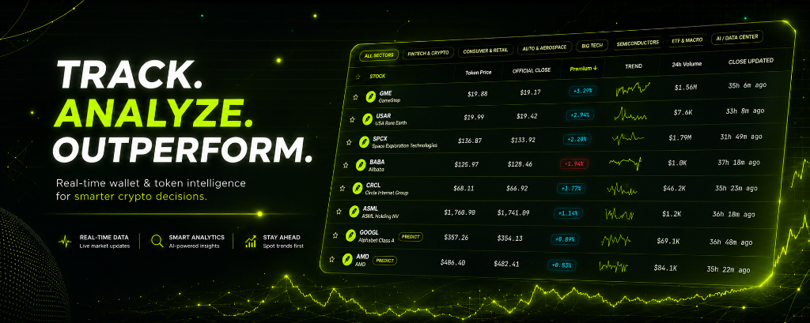

<p align="center">
  
</p>

# MILO — MiloStocks
**The live premium tracker for Robinhood Chain's tokenized stocks — plus a free, non-custodial way to bet on where they open next.**

### 🟢 Live now at **[milostocks.com](https://milostocks.com)**

[X / Twitter](https://x.com/milostocks) · Runs on real Robinhood Chain mainnet price data, refreshed continuously.

---

## How it works

Robinhood Chain is the first chain with **liquid, 24/7-tradable tokenized stocks** (NVDA, AAPL, TSLA, …) issued by a real broker. Two prices exist for every one of these stocks, and they almost never match:

1. **The official close** — Robinhood's real, market-hours-only price, fed on-chain by a Chainlink oracle. It freezes the moment NYSE/NASDAQ shuts for the night, the weekend, or a holiday.
2. **The live token price** — whatever the token is actually trading for on Robinhood Chain's own DEXes, right now, 24 hours a day, 7 days a week.

MILO computes the gap between them, live, for every tracked ticker:

```
premium % = (live DEX token price − frozen official close) / official close
```

A positive premium while the real market is closed means the on-chain crowd is pricing the stock to open **higher**; negative means **lower**. It's the first genuinely new signal this kind of chain makes possible — nobody could see "where the market thinks a stock opens next" before the exchange reopened, until now.

From there, MILO gives you two ways to use that signal:

| | |
|---|---|
| ** Watch it** | The dashboard — every ticker's live premium, sparklines, a session-by-session breakdown, and a ticker × day heatmap. Free, no wallet, no account. |
| ** Bet on it** | **Predict** — non-custodial pari-mutuel markets. Put money on UP or DOWN for a stock's trading session, or the full Friday-close-to-Monday-open weekend gap. Resolved entirely on-chain by reading the same price feed at lock and resolve time — no admin, no oracle you have to trust after the fact. |

Predict has two lanes, so anyone can play regardless of whether they have a wallet:

- **ETH** — bet real (currently testnet) ETH from a connected wallet (MetaMask, Rabby, …). All-time leaderboard.
- **fETH** — a free practice balance, 0.1/week, tied to a cookie-based account with zero setup. Climb the weekly leaderboard, and the top net winner gets a bonus toward next week's claim — with an eye on rewarding the best predictors with a share of the future **$MILO** airdrop.

## What's live vs. what's testnet

MILO is two things bolted together on purpose, at two different maturity levels:

- **The premium tracker is fully live**, reading real Chainlink oracle data and real Blockscout DEX prices off **Robinhood Chain mainnet**, right now, with zero mocked data. This is the part deployed and hosted at milostocks.com.
- **Predict runs on Robinhood Chain testnet.** A prediction market handling real funds deserves a security review before it touches mainnet money — that's a deliberate, not-yet-made decision, so today "ETH" in Predict means testnet ETH. The contracts, the pari-mutuel logic, and the permissionless lock/resolve mechanism are all real and fully working; only the funds at stake are play money for now.

## Features

- **Live premium dashboard** — every tracked ticker's DEX price vs. its official Chainlink close. Sortable table, sparklines, Top Gainers / Top Losers / Most Liquid highlights, a session-by-session premium breakdown, and a ticker × day heatmap.
- **Predict** — see above: ETH and fETH markets, session and weekend-gap variants, two independent leaderboards.
- **Watchlist & Portfolio** — star tickers locally, or look up any wallet's full bet history and standing.
- **Compare** — overlay up to 5 tickers' premium history on one chart.
- **Whale-style wallet tracker** — paste any address, see everything it's bet, no login.
- **Public API + embeddable widget** — open-CORS `/api/premium` endpoints and a bare `<iframe>`-able card per ticker for anyone to build on.

Everything except `/predict` is **read-only** — no accounts, no database, no wallet required.


To use the fETH free-play wallet with persistence across restarts, copy `.env.example` to `.env.local` and fill in an [Upstash Redis](https://console.upstash.com) REST URL + token. Without it, fETH state falls back to a local JSON file (fine for local dev only).

### Scripts

```bash
npm run dev      # dev server (Turbopack)
npm run build    # production build — also the type-check gate
npm run lint     # eslint
npm start        # serve the production build

node scripts/gen-registry.mjs src/lib/registry.ts   # refresh the tracked stock list
node scripts/sync-predict-abi.mjs                   # resync ABIs after a contract change
```

## Prediction market contracts

`contracts/` is a separate Hardhat 3 package — `GapMarket.sol` (ETH) and its free-play sibling `PlayMarket.sol` (fETH). Both are simple, non-custodial pari-mutuel pools: anyone can trigger lock/resolve once the time threshold passes, and the contract reads the price feed itself rather than trusting whoever calls it — the deployer can create markets, nothing else.

```bash
cd contracts
npm install
npm test   # Hardhat test suite
```

